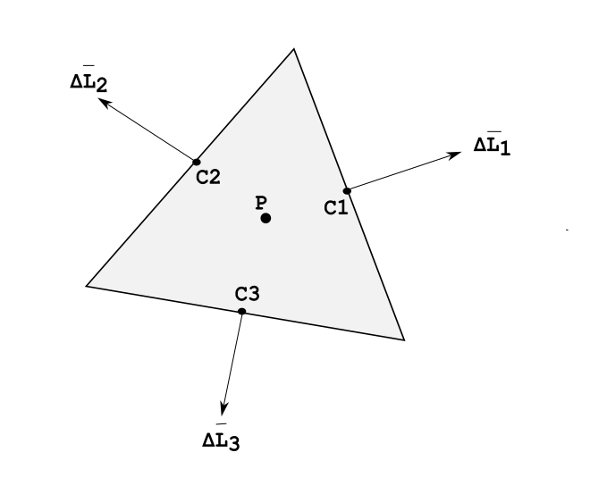
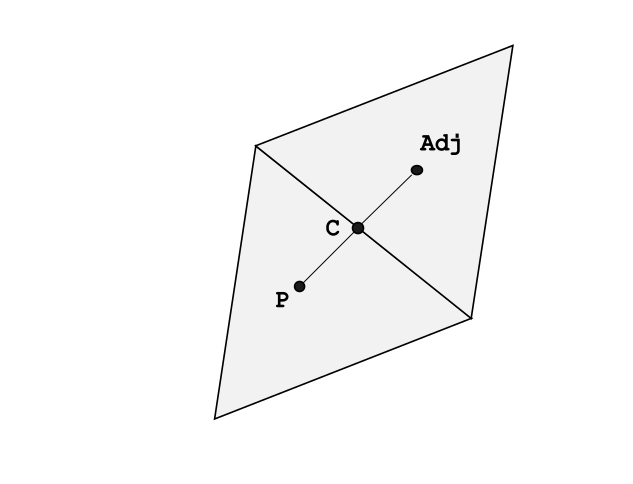

# 1. Computational Fluid Dynamics Using the Finite Volume Method
Author: Simon Bland

Date: February 2025

# 2. Summary

This document provides an introduction to the finite volume method and explains how it is used
in this project's code to solve the Navier-Stokes equations.

# 3. Table of Contents
- [1. Computational Fluid Dynamics Using the Finite Volume Method](#1-computational-fluid-dynamics-using-the-finite-volume-method)
- [2. Summary](#2-summary)
- [3. Table of Contents](#3-table-of-contents)
- [4. Finite Volume Theory](#4-finite-volume-theory)
  - [4.1. Prototypical FVM Problem](#41-prototypical-fvm-problem)
  - [4.2. Gradient Reconstruction](#42-gradient-reconstruction)
  - [4.3. Choice of Interpolation](#43-choice-of-interpolation)
- [5. Finite Volume Method](#5-finite-volume-method)
  - [5.1. Transient Term](#51-transient-term)
  - [5.2. Advection Term](#52-advection-term)
  - [5.3. Diffusion Term](#53-diffusion-term)
  - [5.4. Source Term](#54-source-term)
- [6. The SIMPLE Method and Predictor-Corrector Steps](#6-the-simple-method-and-predictor-corrector-steps)
  - [6.1. Setting Boundary Conditions](#61-setting-boundary-conditions)
  - [6.2. Temporal Discretization](#62-temporal-discretization)
  - [6.3. The SIMPLE Method](#63-the-simple-method)
  - [6.4. The Predictor Step](#64-the-predictor-step)
  - [6.5. The Pressure Poisson Equation](#65-the-pressure-poisson-equation)
  - [6.6. Neumann Boundary Condition Reset](#66-neumann-boundary-condition-reset)
  - [6.7. Corrector Step](#67-corrector-step)
- [7. Implementation and Coding](#7-implementation-and-coding)
- [8. Further Reading and Learning](#8-further-reading-and-learning)

# 4. Finite Volume Theory

An advantage of the finite volume method over the finite difference method
is that it allows computation of solutions to occur in a domain of arbitrary shape.
It also allows us to introduce objects of arbitrary shape into the domain
and model flow around them or through them
(although this capability is not fully implemented in this project).

The finite volume method (FVM) uses the family of mathematical theorems of Green,
Stokes and Gauss (depending on whether we are working in 2D or 3D),
and which we will collectively refer to as the *divergence theorem*,
to rewrite the terms of a conservation equation in a form that can be
solved by iterative methods.

We prepare a solution in three steps:
1. Divide the domain into discrete cells
2. Write a conservation equation for each cell
3. Approximate a volume or surface integral for each cell

Then solve iteratively for each cell by stepping through time in small increments.


## 4.1. Prototypical FVM Problem

Let's consider a cell in a discretized domain.
We can write a conservation equation for a property $\phi$ in one of the cells.

```math
\frac{\partial (\rho\phi)}{\partial t} + \nabla\cdot(\rho \mathbf u \phi) =
\nabla \cdot (\Gamma \nabla \phi) + S\\_\phi
```

Where $\rho$ is density, t is time, $\mathbf u$ is the velocity vector.


We can use this equation to describe any conserved property, e.g.:
1. $\phi = 1, \Gamma = 0, S\\_\phi= 0 \implies$ mass conservation
2. $\phi = u, \Gamma = \mu, S\\_\phi= -\nabla p \implies$ momentum (i.e. Navier-Stokes equations)
3. $\phi = C_pT, \Gamma = \frac {k}{ C\\_p}, S\\_\phi = q \implies$ thermal energy 

Since the terms of the conservation equations are in divergence form,
we can integrate across the control volume, i.e.:

```math
\underbrace{\int_{v}\frac{\partial (\rho \phi)}{\partial t}dv}_{transient} +
\underbrace{\int_{v}\nabla\cdot(\rho \mathbf u \phi)dv}_{advection} =
\underbrace{\int_{v}\nabla\cdot(\Gamma^{\phi}\nabla\phi)dv}_{diffusion} +
\underbrace{\int_{v}S\\_{\phi}dv}_{source} \qquad (1)
```

To show how this equation can be solved iteratively,
we need to introduce two concepts: gradient reconstruction and interpolation.

## 4.2. Gradient Reconstruction

In this domain we have a two dimensional area and a two dimensional surface
(the cell outline) instead of a three dimensional volume and a three dimensional surface.
Going forward, we will reduce the coresponding Lebesque Measures by one,
replacing volume $v$ and surface $s$ with area $a$ and side length $l$.

Let's consider a triangular element with center at point P.
We use a variable f to represent the face and k to refer to the side number.
The center of each side is a point $C\\_k$ and the length of each side is $L\\_k$.

Each vector $\Delta \mathbf L\\_k$ represents the scalar product
of the side length and the outward-facing side unit normal vector.



Applying the divergence theorem:

```math
\int_{a}\nabla\phi da = \int_{l}\phi dl
```

```math
\nabla \phi \approx {1 \over A} \int_l \phi dl
```
```math
\nabla \phi_p = {1 \over A_p} \sum_{k=1}^{N_f} \phi_{C_k} \Delta \mathbf L_{f\\_k} \qquad (2)
```
Where $A\\_p$ is the area of the element.

The result shows that the gradient of our conserved property at the cell center
can be derived from the sum of the fluxes of our conserved property across the edges
of the cell.

Since the geometry of the cell is easy to compute,
the effectiveness of this method then depends on our ability to accurately interpolate
$\phi_{c_k}$, the value of the conserved property, at each integration point $C_k$.

> Throughout this project, we use a cell-centered approach to FVM.
The cell properties are calculated and stored at the cell center.
An alternative method is to use the cell nodes (in this example the triangle vertices)
as the location at which properties are calculated and stored.
The node-centered approach basically reduces to the same method but requires
slightly more memory and requires us to create a virtual cell around each node.


## 4.3. Choice of Interpolation

The choice of interpolation method is usually driven by the characteristics of the flow
regime and the needs of the solution.

In this solution we have used weighted linear interpolation.
The centre of each side is treated as the interpolation point,
irrespective of the cell geometry.

Consider this stencil:



The weighting factor $W$ is determined for each face $f$
based on the ratio of the distance from $P$ to the interpolation point $C$
and the distance from $P$ to the center of the adjoining cell $Adj$.

Then $\phi_f$ at the interpolation point is calculated as:

```math
\phi_f \simeq (1-W) \phi_p + W \phi_{adj}  \qquad (3)
```

# 5. Finite Volume Method

Now let's examine the terms of equation (1) separately and show how each
can be transformed and discretized by applying equations (2) and (3).
Again, a reminder that we are working in a 2D domain with area $a$ and
perimeter $l$.

## 5.1. Transient Term

This term shows the change in $\phi_p$ with time.


```math
\int_{a}\frac{\partial (\rho \phi)}{\partial t}da = {{\rho \phi_p^{n+1} - \rho \phi_p^{n}}\over{\Delta t}} \qquad (4)
```

Here, $n$ represents the $n^{th}$ timestep, t is time.

## 5.2. Advection Term

This term shows the transport of $\phi\\_p$ by $\mathbf u$:

```math
\int_{a}\nabla\cdot(\rho \mathbf u \phi)da = \int_l \rho \mathbf u \phi \cdot \mathbf {\hat n} dl
```
```math
 \nabla\cdot(\rho \mathbf u \phi)= {1 \over A_p} \int_s \rho \mathbf u \phi \cdot \mathbf {\hat n} dl
```
```math
 \nabla\cdot(\rho \mathbf u \phi)\simeq {1 \over A_p} \sum_{k=1}^{N_k} \rho (\mathbf u \cdot \mathbf {\hat n})_f \phi_f L_f \qquad (5)
```
Where $L_f$ is the side length, $\mathbf {\hat n}_f$ is the face normal.

The advection term can thus be obtained by looping over the list of edges in each cell
and calculating a simple product before dividing by the cell area.

## 5.3. Diffusion Term

Viscosity transmits shear forces to the fluid. When using FVM to solve for heat flow,
$\Gamma$ may also be interpolated as it varies with temperature.

```math
\int_{a}\nabla\cdot(\Gamma \nabla \phi)da = \int_l \Gamma (\nabla \phi \cdot \mathbf {\hat n}) dl
```

```math
\nabla\cdot(\Gamma \nabla \phi)da = {1 \over A_p} \int_l \Gamma (\nabla \phi \cdot \mathbf {\hat n}) dl
```

```math
\nabla\cdot(\Gamma \nabla \phi)\simeq {1 \over A_p} \sum_{k=1}^{N_k} \Gamma (\nabla \phi \cdot \mathbf {\hat n})_f L_f \qquad (6)
```
Where:

```math
\nabla \phi_f \approx {{\phi_{adj} - \phi_p}\over{distance_{p - adj}}} \cdot \mathbf {\hat n} \qquad (7)
```
Which we should note is not accurate if the line connecting the centers
has a large angle with the cell faces.

## 5.4. Source Term

For momentum conservation, we set $S_{\phi}$ equal to $-\nabla p$.
A negative pressure gradient provides a positive force in the direction of the
$x$ and $y$ coordinate axes. 

```math
\int_{a}S_{\phi}da = - \int_{a}\nabla p_p  da = - \int_l p_f \mathbf {\hat n} dl
```
```math
\nabla p_p = {1 \over A_p}\int_l p_f \mathbf {\hat n} dl
```

```math
\nabla p_p \simeq - {1 \over A_p} \sum_{k=1}^{N_k} p_f \mathbf {\hat n} _f L_f \qquad (8a)
```

> Note that trying to obtain the second derivative by using a second application
of the divergence theorem does not yield an equation from which we can easily derive
an expression for $p$.
Instead we write:

```math
\nabla^2 p_p \simeq - {1 \over A_p} \sum_{k=1}^{N_k} \nabla p_f \mathbf {\hat n} _f L_f \qquad (8b)
```


# 6. The SIMPLE Method and Predictor-Corrector Steps

There are a mere handful of cases where we can obtain an exact solution for the momentum conservation equation
(Navier-Stokes equation),
and no general solution is known to exist.
However, there are several ways to solve them numerically,
each of which involves some amount of simplification or compromise.

To explain the SIMPLE method and predictor-corrector approach to solving the Navier-Stokes
equations, let's re-formulate the conservation equation (1)
as the Navier-Stokes equation in a two dimensional domain.

> We will consider incompressible flow only,
so that the density $\rho$ and
kinematic viscosity $\nu = {\mu \over \rho}$ are constant throughout.

```math
\int_{a}\frac{\partial \phi_p}{\partial t}da +
\int_{a}\nabla\cdot(\mathbf u_p \phi_p)da =
\int_{a}\nu \nabla\cdot({\phi_p}\nabla\phi_p)da -
{1 \over \rho}\int_{a}\nabla p_p da \qquad (10)
```
Where $\phi_p = \mathbf u_p$.

While the approximations described above are straightforward,
the Navier-Stokes equations are non-linear in $\mathbf u$.
They cannot be solved directly using an $A \mathbf x = b$ type solver.

Instead, we must solve them iteratively. 

## 6.1. Setting Boundary Conditions

The solution begins by setting Dirichlet conditions at the domain boundary.
These are fixed values for the $u$ and $v$ components of $\mathbf u$, and $p$, 
which will remain unchanged in the subsequent calculations.

In this project's code,
$u$ and $v$ are set everywhere to $0$ except on the cavity lid boundary cells where
u is set to the chosen lid velocity.

We set a nominal initial value for $p = 0$ everywhere except on the cavity lid
boundary cells where we set $p = 1$.

## 6.2. Temporal Discretization

After setting Dirichlet conditions,
we start to propogate velocity and pressure through the domain in steps of time until they (hopefully) become stable in value.

Substituting equations (4), (5), (6) and (8) into (10), at the $n^{th}$ timestep we have:

```math
\rho {{\phi_p^{n+1}-\phi_p^n} \over {\Delta t}} =
{1 \over A_p} \sum_1^N
\Big[
  \mu(\nabla\phi\cdot \mathbf {\hat n})L_f
  -\rho(\mathbf u \cdot \mathbf {\hat n})\phi_f L_f
  -(\nabla p \cdot \mathbf {\hat n}) L_f
\Big]
```
Dividing by $rho$ and rearranging terms.

```math
\phi_p^{n+1} =
{\Delta t \over A_p} \sum_1^N \Big[
  \Big(
    \nu(\nabla\phi\cdot \mathbf {\hat n})
    - (\mathbf u \cdot \mathbf {\hat n})\phi_f
    - {1 \over \rho}(\nabla p \cdot \mathbf {\hat n})
  \Big)
  L_f
\Big]
+ \phi_p^n \qquad (12)
```

## 6.3. The SIMPLE Method

Equation (10) represents the conservation of momentum.
Equation (11) represents mass conservation at constant density.

There is no pressure term in the incompressible continuity equation (11) to provide a relation between velocity and pressure
(in contrast, in compressible flow the mass continuity provides an equation for the density $\rho$,
which we use along with an equation of state to relate density and pressure). 

The workaround is to use a predictor-corrector method which first solves for velocity in the absence of pressure,
then correct for pressure in a second step.

## 6.4. The Predictor Step

Dropping the pressure term from equation (12) and rewriting $\phi^{n+1}$ as $\phi^*$
gives the predictor equation for each cell:

```math
\phi_p^*=
{{\Delta t}\over A_p}\sum_1^N
  \Big[
    \Big(
      \nu(\nabla \phi \cdot \mathbf {\hat n})_f
      - (\mathbf u_p \cdot  \mathbf {\hat n}) \phi_f
    \Big)
    L_f
  \Big]
+ \phi_p^n \qquad (13)
```

Where:

```math
\frac{\phi^{n+1}-\phi^*}{\Delta t}=
-\frac{1}{\rho A_p}\sum_1^N
(
  \nabla p \cdot \mathbf {\hat n}
)_f
L_f \qquad (14)
```

## 6.5. The Pressure Poisson Equation

To solve for $\phi^*$, it is helpful to return to equation (10) and
revert to an earlier version of the source term.

$$
\nabla \int_{a}\big( \frac{\phi^{n+1}-\phi^*}{\Delta t} \big) da=
-\nabla {1 \over \rho}\int_{a}\nabla p_p da
$$

By continuity:

$$
\nabla \cdot \phi^{n+1} = 0
$$

Therefore:

```math
\nabla ^2 p^{n+1} = 
\frac{\rho}{\Delta t} \nabla \cdot \phi^* \qquad (15)
```
 
Using the values for $\phi^*$ from (13), it is possible to derive an equation for $p$.

Using the divergence theorem, the right hand side of equation (15) can be written as:

```math
b =
\frac{\rho}{\Delta t A_p} \sum_1^N
  \phi_f^* \cdot \mathbf {\hat n}
L_f \qquad (16)

```
An approximate value for $\nabla p$ at the interpolation point of the face is:

```math
\nabla p_f \approx
  \frac{(p_k - p_p)}{| \mathbf r_k |} \mathbf {\hat n}_f \qquad (17)
```
Where $| \mathbf r_k|$ is the distance from cell center P to the adjacent cell center.

Substituting (17) into equation (8b), the left hand side of (15) can now be written as:

```math
\frac{1}{ A_p} \sum_1^N \big(\nabla p \cdot \mathbf {\hat n})_f L_f  = 
\frac{1}{ A_p} \sum_1^N
  \Big[
    \frac{(p_k - p_p)}{| \mathbf r_k |} \mathbf {\hat n}_f\cdot \mathbf {\hat n}_f L_f
  \Big]
```

```math
 = \frac{1}{ A_p} \sum_1^N
  \Big[
    \frac{(p_k - p_p)}{ | \mathbf r_k |} L_f
  \Big]
  \qquad (17)
 ```

Combining (16) and (17) we can obtain an equation for $p_p$.


```math
 b = \frac{1}{ A_p} \sum_1^N\Big[\frac{(p_k - p_p)}{ | \mathbf r_k|} L_f \Big]
 ```

Rearranging terms:

```math
 p_p^{n+1} = \frac{ \sum_1^N\Big[p_k \frac{L_f}{ | \mathbf r_k|} \Big] - A_p b}{\sum_1^N \frac{L_f}{|\mathbf r_k|}} \qquad (18)
  ```

## 6.6. Neumann Boundary Condition Reset

Before proceeding to the next timestep, we set Neumann boundary conditions.
The derivatives $\frac{\partial p}{\partial x}$ at the left and right boundary and
$\frac{\partial p}{\partial y}$ at the bottom boundary are set to 0.
We do this by changing the value of p in cells adjacent to the boundary to
match p in the boundary cells.

## 6.7. Corrector Step

With the value for p now at hand, we calculate $\nabla p$ as:

```math
\nabla p_p^{n+1} = \sum_1^N p_k W \mathbf {\hat n}L_f \qquad (19)
```

Then substitute equation (19) into equation (14), finally giving:

$$
\phi_p^{n+1}=\Delta t\left( - \frac{A_p}{\rho}  \nabla p_p^{n+1}\right) + \phi_p^*  \qquad (20)
$$

Then proceed to the next timestep.

# 7. Implementation and Coding

Unlike the simple uniform grid used in the finite difference method,
the grid in FVM requires significantly more code to create.
There is a also a need to perform pre-calculation of grid parameters,
for example, we need to calculate and store things like face normals,
cell side lengths, the distance from cell center to integration points and
adjacent cell centers, as well as cell areas.

Grid geometry calculations and the nature of the equations produced by the
divergence theorem mean that *Vector2* type is used for most non-scalar variables,
and built-in vector methods are used throughout.

Note that to make the code easier to read,
$\phi$ has been used as a variable when calculating the X and Y components
of $\mathbf u$ for the advection terms.

Variable descriptions are provided in the code comments.
The following definitions may be helpful when reading though this section:

For cells:

```Csharp
/// <summary>
/// Inverse of the cell area
/// </summary>
 public float AreaI { get; set; }

/// <summary>
/// Sum of the ratios of cell side lengths to distance from cell center to adjoining cell center
/// </summary>
public float Lk { get; set; }  
```

For edges:

```Csharp
/// <summary>
/// edge length
/// </summary>
public float L { get; set; }

/// <summary>
/// ratio of edge length to distance from cell center to adjoining cell center
/// </summary>
public float Lk { get; set; }
        
/// <summary>
/// face normal (points out from element)
/// </summary>
public Vector2 N { get; set; }

/// <summary>
/// vector from cell center to adjoining cell center
/// </summary>
public Vector2 Rk { get; set; }

```

We do some additional pre-calculation in the code to make computations less expensive,
for example constants and variables used in division are inverted
to enable multiplication instead. These are performed immediately on running the CFD solution.

In C#:
```Csharp

//pre-inversion of some values to reduce calc time
float dti = 1 / calc.Dt;
float rhoi = 1 / fluid.Rho;

```
After setting the Dirchlet boundary conditions,
we run a loop through time in which all cells are processed in parallel.
Summation over the faces is done by looping over the cell edges.

> While the creation of first order partial derivatives
is largely provided for by the divergence theorem, second order derivatives
are best obtained by interpolating a value for the first derivative at the
integation points, then using the divergence theorem to obtain the second derivative.

In C#:
```Csharp

//Loop through the cell edges.
foreach (Edge e in cell.Edges)
{
  //U
  //interpolate for face values using weighting (ignore any numerical diffusion perpendicular to face normal)
  float phiIpU = _data.CellList[e.AdjoiningCell].Vel.X * e.W + cell.Vel.X * (1 - e.W);

  //diffusion calculated as nu * div.grad(phi) boundary geometry is taken into account
  diffusionU += (_data.CellList[e.AdjoiningCell].Vel.X - cell.Vel.X) * e.Lk;

  //calculate convection terms using Green-Gauss without interpolating velocity as div.(U phi)
  convectionU += Vector2.Dot(cell.Vel * phiIpU, e.N) * e.L;

  //V
  //interpolate for face values using weighting (ignore any numerical diffusion perpendicular to face normal)
  float phiIpV = _data.CellList[e.AdjoiningCell].Vel.Y * e.W + cell.Vel.Y * (1 - e.W);

  //diffusion calculated as nu * div.grad(phi) boundary geometry is taken into account
  diffusionV += (_data.CellList[e.AdjoiningCell].Vel.Y - cell.Vel.Y) * e.Lk;

  //calculate convection terms using Green-Gauss without interpolating velocity as div.(U phi)
  convectionV += Vector2.Dot(cell.Vel * phiIpV, e.N) * e.L;
}

```

$\mathbf u^*$ in (13) is calculated by combining the terms above.

In C#:

```Csharp

//predictor step uStar and Vstar. We divide by area here so it is only done in one place.
cell.VelStar = new Vector2(cell.Vel.X + (diffusionU * fluid.Nu - convectionU) * calc.Dt * cell.AreaI, cell.Vel.Y + (diffusionV * fluid.Nu - convectionV) * calc.Dt * cell.AreaI);

```

Calculating the right-hand side of the Pressure Poisson equation.

In C#:

```Csharp

foreach (Edge e in cell.Edges)
{
                        
  //Vector2 velStarIP;
  b += Vector2.Dot(_data.CellList[e.AdjoiningCell].VelStar * e.W, e.N) * e.L;

}

// division by area here is cancelled out with later multiplication by area,
// see [**] below
cell.B = b * fluid.Rho * dti;

```

Then pressures are cloned:

In C#:
```Csharp

//all cells (including borders) need P clone
Parallel.ForEach(_data.CellList, cell => { cell.PN = cell.P; });

```

Then the new values for pressure are calculated.

```Csharp

float pTerm = 0;

foreach (Edge e in cell.Edges)
  {

      //note that the ratio Lk takes cell and boundary geometry into into account
      pTerm += _data.CellList[e.AdjoiningCell].PN * e.Lk;

  }

// [**] earlier division by area is cancelled out with multiplication by area here
cell.P = (pTerm - cell.B) / cell.Lk;

```

After the Neumann boundary condition reset,
we then calculate $\nabla p$ using the divergence theorem and then perform
the corrector step, yielding new values for $\mathbf u$.

```Csharp

foreach (Edge e in cell.Edges)
{
    //since we don't need to derive the second derivative, we use face values for P
    gradP += _data.CellList[e.AdjoiningCell].P * e.W * e.L * e.N;
}

//do corrector step
cell.Vel = cell.VelStar - gradP * calc.Dt * cell.AreaI * rhoi;

```

At which point, we complete this time loop and move on to the next.

# 8. Further Reading and Learning

Most of the coding in this project was done after first working though the finite difference algorithms discussed by Alvarez and Nobe [1],
and building a finite difference engine and solution.

The finite volume method project was built after following a series of YouTube lectures, particularly those
by Prof. Clovis Maliska of SINMEC, the Federal University of Santa Catarina - Brazil [2]

1. [Alvarez and Nobe](https://colab.research.google.com/github/josealvarez97/The-Ultimate-Guide-to-Write-Your-First-CFD-Solver/blob/main/The_Ultimate_Guide_to_Write_Your_First_CFD_Solver.ipynb)
2. [Maliska-SINMEC](https://www.youtube.com/watch?v=8S0KdGJq3LI)
